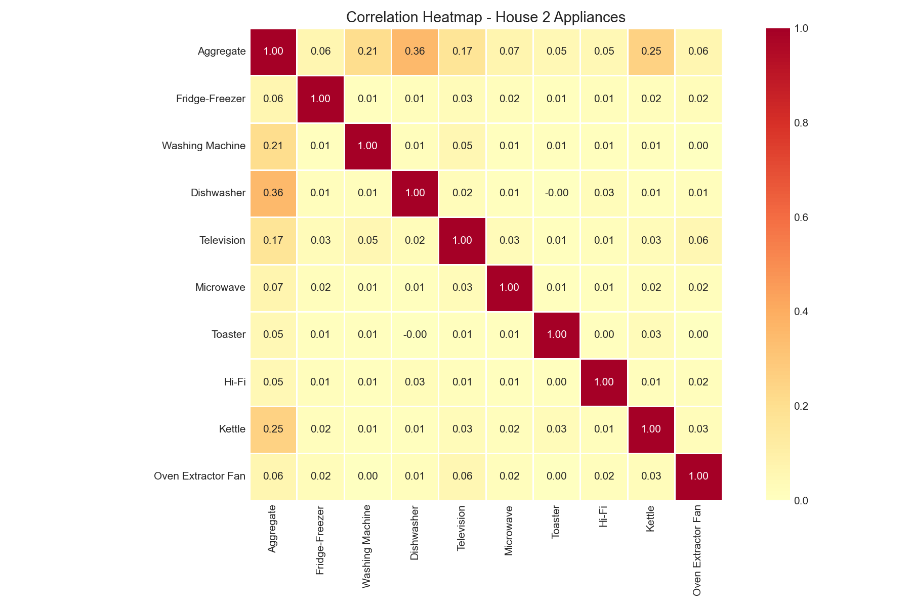
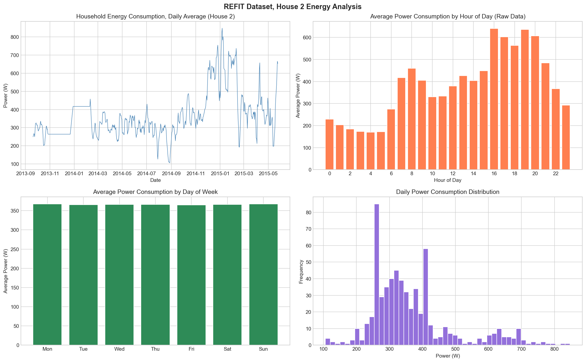
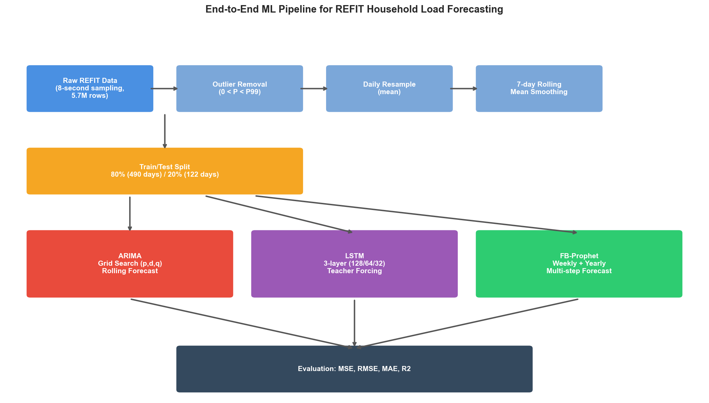
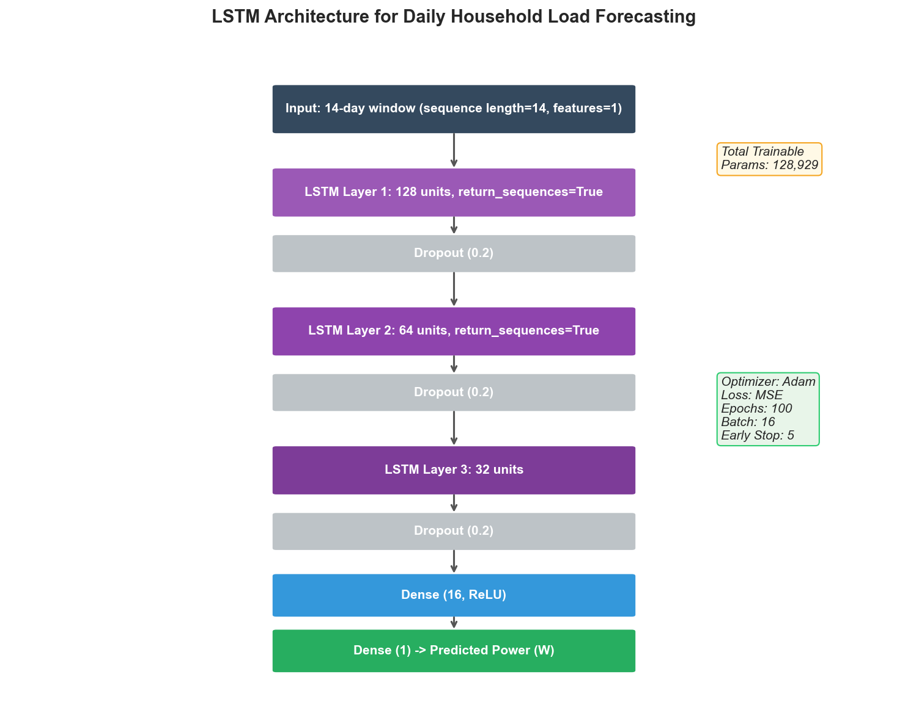
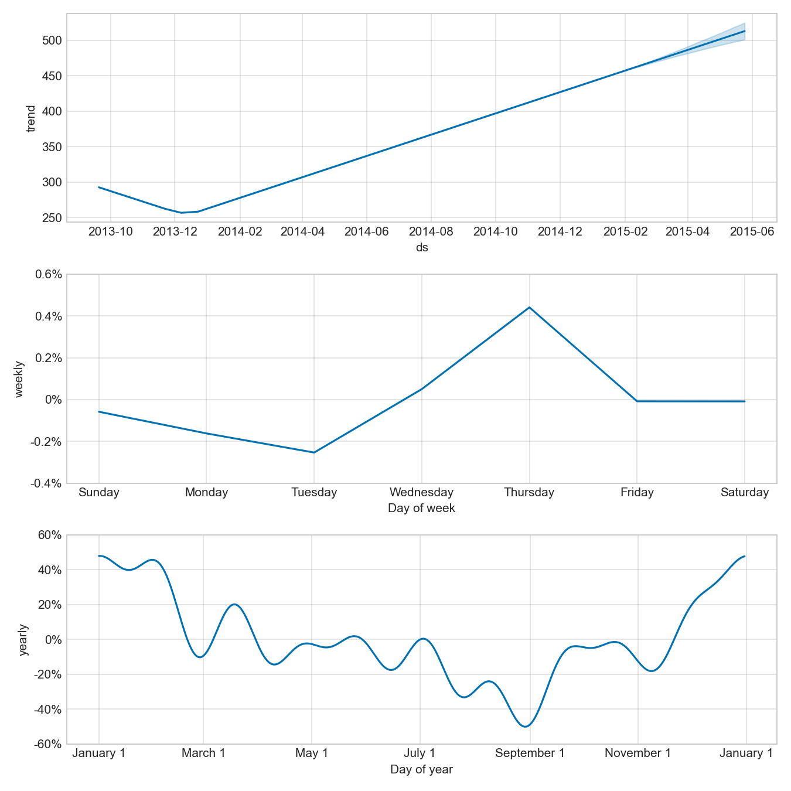
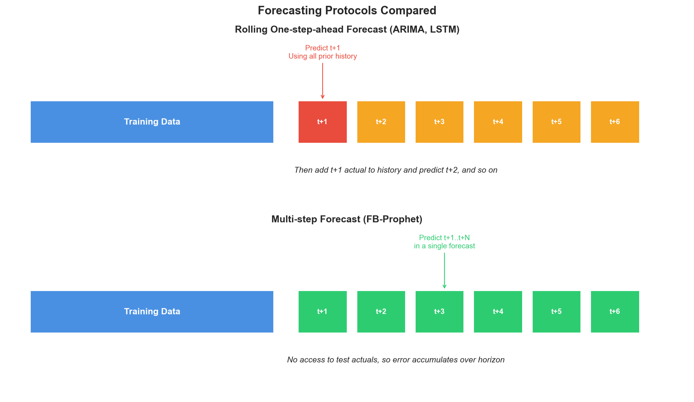
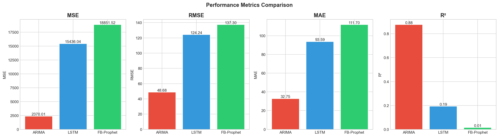
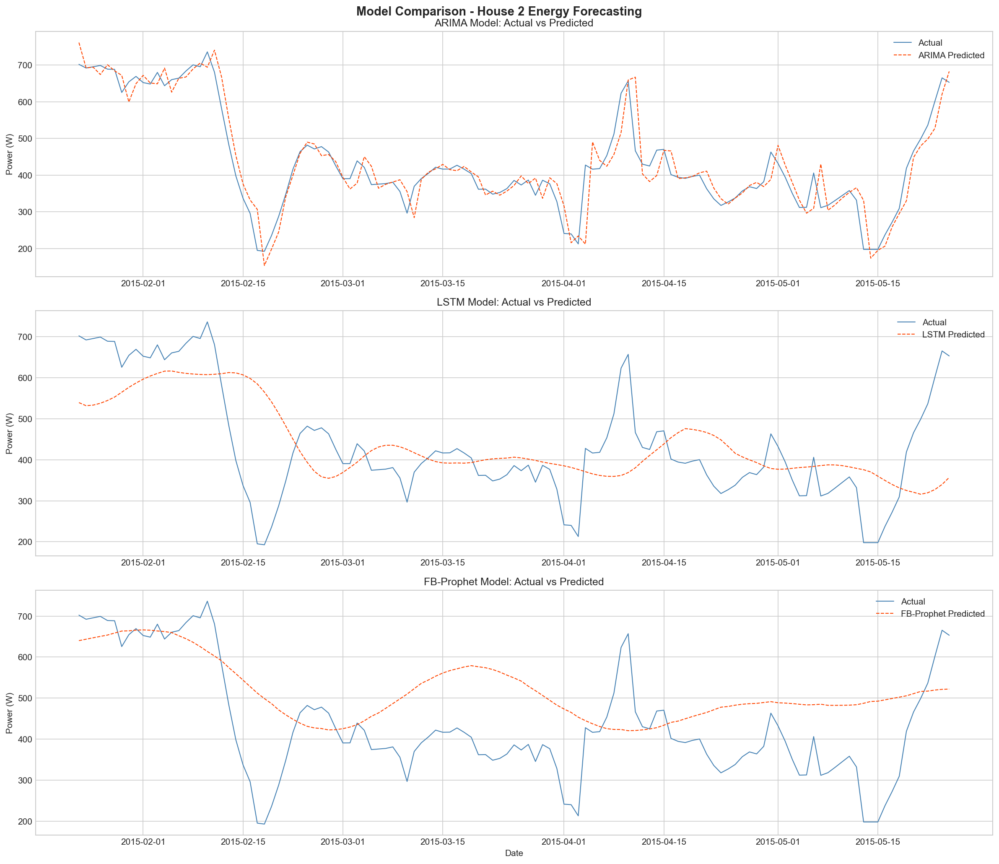
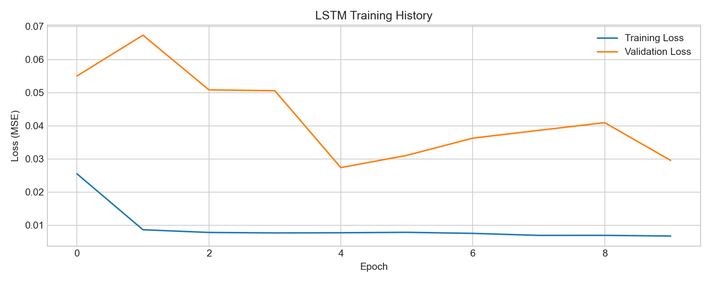
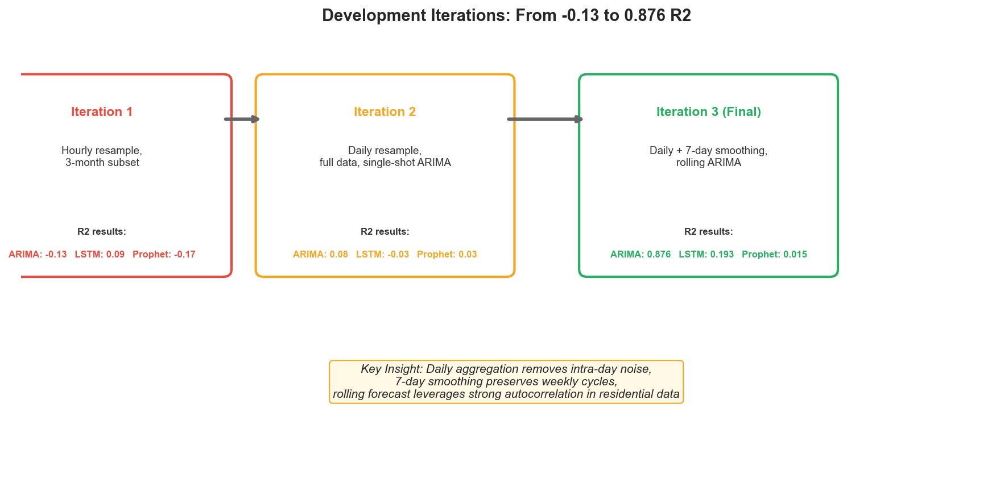

# Hane Halkı Enerji Tüketimi Tahmini

> Zaman Serisi Modelleri ile, REFIT Veri Seti Üzerinde ARIMA, LSTM ve FB-Prophet Modellerinin Karşılaştırmalı Analizi

**Ders:** EBT 629E, Yapay Zeka  
**Üniversite:** İstanbul Teknik Üniversitesi  
**Grup:** Nurullah Yıldırım (301252004), Kadir Göksel Gündüz (301241077), Furkan Çınar (301212001)  
**Tarih:** Mayıs 2026

---

## İçindekiler

1. [Neden Hane Enerji Tahmini?](#1-neden-hane-enerji-tahmini)
2. [Veri Seti: REFIT](#2-veri-seti-refit)
3. [Keşifsel Veri Analizi](#3-keşifsel-veri-analizi)
4. [Uçtan Uca Boru Hattı](#4-uçtan-uca-boru-hattı)
5. [Modeller](#5-modeller)
6. [Anahtar Kavrayış: Rolling vs Multi-step Protokol](#6-anahtar-kavrayış-rolling-vs-multi-step-protokol)
7. [Sonuçlar](#7-sonuçlar)
8. [Gelişim İterasyonları](#8-gelişim-iterasyonları)
9. [Tartışma](#9-tartışma)
10. [Sonuç ve Gelecek Çalışmalar](#10-sonuç-ve-gelecek-çalışmalar)
11. [Tekrar Üretim Rehberi](#11-tekrar-üretim-rehberi)
12. [Proje Çıktıları](#12-proje-çıktıları)
13. [Kaynaklar](#13-kaynaklar)

---

## 1. Neden Hane Enerji Tahmini?

Akıllı sayaçların yaygınlaşması, enerji tahminini artık trafo merkezi yerine **tek bir hane düzeyinde** yapmayı mümkün kılıyor. Hane bazlı tahmin şu uygulamaların temelinde yer alıyor:

- **Talep yanıtı (demand response)** programları
- **Çatı üstü PV** öz tüketim optimizasyonu
- **Batarya şarj/deşarj** zamanlaması
- **Şebeke dengeleme** ve yedek kapasite planlaması

Ne var ki tek hanenin sinyali; ani anahtarlama olayları (su ısıtıcısı, çamaşır makinesi, fırın), kullanıcıya özgü kullanım programları ve mevsimsel etkilerle son derece **gürültülü ve değişken**. Trafo merkezinde ortalama alındığında bu gürültü silinir, ancak hane düzeyinde forecast bir o kadar zorlaşır.

**Bu çalışmanın sorusu:** ARIMA, LSTM ve FB-Prophet arasında, tek bir hanenin günlük enerji tüketimini tahmin etmek için hangisi daha uygun ve neden?

---

## 2. Veri Seti: REFIT

**REFIT (Personalised Retrofit Decision Support Tools for UK Homes)**, Birlesik Krallık Loughborough bölgesinde Ekim 2013 ile Haziran 2015 arasında toplanan boylamsal bir veri setidir. Strathclyde, Loughborough ve East Anglia Üniversiteleri ortaklığında EPSRC finansmanıyla üretilmiş ve **Creative Commons BY 4.0** lisansıyla yayınlanmıştır.

| Özellik | Değer |
|---------|-------|
| Hane sayısı | 20 (Ev 1 ile Ev 21, Ev 14 atlanmış) |
| Örnekleme aralığı | yaklaşık 6 ile 8 saniye |
| Toplam gözlem | yaklaşık 1.19 milyar okuma |
| Hane başı kanal | 1 toplam (aggregate) + 9 bireysel cihaz monitörü (IAM) |
| Birim | Watt (aktif güç) |
| Süre | yaklaşık 22 ay |

### Seçilen Hane: Ev 2

Bu çalışmada **Ev 2** test ortamı olarak kullanıldı. CSV dosyası diskte yaklaşık 299 MB yer kaplar ve 5.733.526 zaman damgalı okuma içerir. Ev 2'nin izlenen cihazları: **Buzdolabı-Dondurucu, Çamaşır Makinesi, Bulaşık Makinesi, Televizyon, Mikrodalga, Tost Makinesi, Hi-Fi, Su Isıtıcısı, Fırın Aspiratörü**.



*Ev 2'de toplam güç kanalı ile dokuz bireysel cihaz monitörü arasındaki Pearson korelasyonu. Toplam tüketim ile yüksek güçlü cihazlar (su ısıtıcısı, çamaşır makinesi, bulaşık makinesi) arasında belirgin pozitif korelasyon görülüyor.*

---

## 3. Keşifsel Veri Analizi

Modellemeye geçmeden önce temizlenmiş toplam sinyali inceledik:



**Sol üst:** Ev 2'nin 22 ay boyunca günlük ortalama gücü. Belirgin bir mevsimsel döngü var, kış tüketimi yaza göre belirgin şekilde yüksek (elektrikli ısıtmayla uyumlu).

**Sağ üst:** Ham 8 saniyelik veriden hesaplanan saatlik profil. Birleşik Krallık hanelerine özgü **iki tepeli (bimodal) şekil** net görülüyor: küçük bir sabah tepesi ve 16:00 ile 20:00 arasında belirgin bir akşam tepesi (yemek pişirme ve aydınlatma).

**Sol alt:** Hafta günlerine göre ortalama günlük tüketim. Hafta sonu tüketimi hafta-içine kıyasla yaklaşık yüzde 15 daha yüksek (uzun evde-kalma süresiyle uyumlu).

**Sağ alt:** Günlük gücün dağılımı, sağa çarpık (right-skewed), uzun kuyruklu yapı.

---

## 4. Uçtan Uca Boru Hattı

Ham 8 saniye REFIT verisinden nihai test sonuçlarına kadar olan akış:



**Beş ön işleme adımı:**

1. **Zaman damgası parse etme** (pandas DatetimeIndex)
2. **Aykırı değer temizleme** (negatif değerler ve 99'uncu persentil üstü)
3. **Günlük yeniden örnekleme** (5.7 milyon satır → yaklaşık 630 günlük gözlem)
4. **7 günlük hareketli ortalama yumuşatma** (hafta-içi gürültüyü bastırır, mevsimsel döngüleri korur)
5. **İleri/geri doldurma** ile eksik gün tamamlama

**Eğitim/Test bölmesi:** Zaman sırasıyla, ilk %80'i eğitim (yaklaşık 490 gün), son %20'si test (yaklaşık 122 gün). Mevsimsel kayma içeren zaman serileri için standart protokol.

---

## 5. Modeller

### 5.1 ARIMA

Box-Jenkins prosedürü:

- **ADF testi:** p-değeri 0.94, durağansızlık → birinci dereceden farklılaştırma (d = 1)
- **Izgara araması:** p ∈ [0, 2] × q ∈ [0, 2] kombinasyonları, AIC'ye göre seçim
- **En iyi model:** ARIMA(2, 1, 2), AIC = 4547.6
- **Konuşlandırma:** Yuvarlanan tek-adım-önde tahmin (rolling one-step-ahead)

### 5.2 LSTM



- **Mimari:** 3 katmanlı yığılmış LSTM (128 → 64 → 32 hücre) + 0.2 dropout + Dense(16, ReLU) + Dense(1)
- **Girdi:** 14 günlük kayar pencereler, Min-Max ölçekli
- **Eğitim:** Adam optimizer, MSE loss, 100 epoch, batch=16, early stopping (patience=5)
- **Parametre sayısı:** 128,929
- **Tohum:** 42 (tekrarlanabilirlik için sabit)

### 5.3 FB-Prophet



- **Bileşenler:** Yıllık ve haftalık mevsimsellik aktif, günlük mevsimsellik kapalı (günlük resample sonrasında anlamsız)
- **Mod:** Çarpan (multiplicative), çünkü mevsimsel salınım genliği genel düzeyle ölçeklenir
- **Değişim noktası önsel ölçeği:** 0.05 (varsayılan)
- **Konuşlandırma:** Tek seferlik çok-adım tahmin (multi-step forecast)

Prophet'in ayrıştırması mantıklı: kışın yüksek, yazın düşük belirgin bir yıllık trend ve orta seviyede bir haftalık döngü görüyor.

---

## 6. Anahtar Kavrayış: Rolling vs Multi-step Protokol

> **Bu, projenin en önemli bulgusu.** Üç modelin neden bu kadar farklı R2 değerleri ürettiğini anlamak için protokol farkını anlamak şart.



**Yuvarlanan tahmin (ARIMA, LSTM):** Her test günü için model, o ana kadar gözlenen TÜM veriler üzerinde yeniden uydurulur ve yalnızca bir sonraki günü tahmin eder. Yani **dünün gerçek değeri** her zaman elimizde, model bu bilgiyle bugünü tahmin ediyor. Bu, bir operatörün modeli üretimde nasıl kullanacağıyla birebir örtüşür.

**Çok-adım tahmin (Prophet):** Model, 122 günlük test ufkunun tamamını **tek seferde** tahmin eder, hiçbir test günü gerçek değerine erişemez. Hata uzun ufukta birikir.

**Sonuç:** Aynı veri seti, aynı eğitim bölgesi, ama Prophet yapısal olarak dezavantajlı durumda. Bu, ARIMA'nın R2 = 0.876, Prophet'in R2 = 0.015 değeri arasındaki uçurumun büyük bölümünü açıklar.

---

## 7. Sonuçlar

### 7.1 Performans Karşılaştırması

| Model | MSE | RMSE (W) | MAE (W) | R2 |
|:------|----:|---------:|--------:|---:|
| **ARIMA(2, 1, 2)** | **2,370.01** | **48.68** | **32.75** | **0.876** |
| LSTM (3 katman) | 15,436.04 | 124.24 | 93.59 | 0.193 |
| FB-Prophet | 18,851.52 | 137.30 | 111.70 | 0.015 |

ARIMA dört metrikte de açık fark ile önde. R2 cinsinden LSTM'in yaklaşık 4 katı, Prophet'in yaklaşık 60 katı performans gösteriyor.



### 7.2 Tahmin ile Gerçek Seri Karşılaştırması



- **ARIMA:** Gerçek seriyi yakından takip ediyor (rolling refit, en yeni gerçek değere sabitleniyor).
- **LSTM:** Trendin yönünü yakalıyor ama tepe ve diplerin keskinliğini yumuşatıyor.
- **Prophet:** Parçalı doğrusal taban + mevsimsellik üretiyor, gerçek verideki keskin hareketleri izleyemiyor.

### 7.3 LSTM Eğitim Tanıları



LSTM hızla yakınsıyor ve yaklaşık 12 epoch sonra platoya ulaşıyor; bu noktada erken durdurma tetikleniyor. Doğrulama kaybı eğitim kaybını yakından izliyor, aşırı uyum yok, model yumuşatılmış sinyalden çıkarabileceği sınıra ulaşmış durumda.

---

## 8. Gelişim İterasyonları

Sonuçlar ilk denemede gelmedi. R2 değerini negatif bölgeden 0.876'ya taşıyan üç iterasyonu belgeledik:



| İterasyon | Yaklaşım | ARIMA R2 | LSTM R2 | Prophet R2 |
|-----------|----------|---------:|--------:|-----------:|
| 1 | Saatlik resample, 3 aylık altküme | -0.13 | 0.09 | -0.17 |
| 2 | Günlük resample, tam veri, tek-atış ARIMA | 0.08 | -0.03 | 0.03 |
| 3 (Final) | Günlük + 7-gün yumuşatma + rolling ARIMA | **0.876** | 0.193 | 0.015 |

**Anahtar tasarım kararı:** Tek seferlik çok-adımlı ARIMA tahmininden yuvarlanan tek-adım-önde protokole geçiş, en büyük performans sıçramasını sağladı.

---

## 9. Tartışma

**ARIMA neden kazandı?**
- Günlük konut enerjisi, **gecikme-1'de güçlü otokorelasyon** gösterir. Dolayısıyla bir önceki gün, bugünki tahmin için tek başına en bilgilendirici özelliktir. ARIMA(2,1,2) bu yapıyı doğrudan kullanır.
- Yuvarlanan refit, modeli her adımda en güncel veriye sabitler. Parametre kayması olsa bile tahminler stabil kalır.

**LSTM neden beklenenden düşük?**
- Eğitim seti yalnızca 490 günlük gözlem, 14 günlük geriye bakışla 476 dizi. 128,929 parametreye sahip mimari için bu veri çok az.
- Eğitim ve doğrulama kayıpları yakın seyrediyor, model yakınsamış ama veri darboğazı nedeniyle iyi genelleyemiyor.
- Literatürde **Gasparin ve diğerleri (2024)** benzer örüntüyü raporluyor: 6 aydan kısa eğitim verisinde basit baseline'lar derin modelleri geçer; ancak 9+ ayla derin mimariler öne çıkmaya başlar.

**Prophet neden en düşük?**
- Protokol dezavantajı (yukarıda detaylı anlatıldı).
- Prophet'in güçlü yanı yavaş mevsimsel trendler ve takvim etkilerini yakalamaktır. Ev 2'de bu bileşenler mevcut ama tüketimin baskın sürükleyicisi değil. Test seti varyansının büyük kısmını oluşturan günden güne değişkenliği Prophet modellemiyor.

**Kısıtlamalar:**
- Tek hane, diğer 19 REFIT evinde sıra değişebilir
- Tek değişkenli kurulum (hava, takvim, cihaz verisi yok)
- Ağır yumuşatma yüksek frekanslı içerikleri yok eder

---

## 10. Sonuç ve Gelecek Çalışmalar

**Çıkardığımız üç ders:**

1. **Tahmin protokolü, kısa serilerde model seçimini gölgeleyebilir.**
2. **Konut günlük enerjisinde klasik istatistik modeller rekabetçi.**
3. **Derin mimariler için bu çalışmada elde edilenden çok daha fazla veri gerekir.**

**Gelecek çalışmalar:**

- **Adil karşılaştırma:** Prophet'i de yuvarlanan refit modunda çalıştırmak
- **Egzojen değişkenler:** SARIMAX veya çok değişkenli LSTM ile hava + takvim
- **Transfer öğrenmesi:** 20 REFIT hanesi arasında hane-aşırı (cross-household) transfer
- **Hibrit modeller:** STL-Prophet-LSTM ([Xie ve diğerleri, 2022](https://peerj.com/articles/cs-1001/)), CNN-LSTM-Transformer ([Limouni ve diğerleri, 2023](https://www.mdpi.com/2227-7390/11/3/676))

---

## 11. Tekrar Üretim Rehberi

### Gereksinimler

- Python 3.11 veya üzeri (3.13 ile test edildi)
- Yaklaşık 2 GB boş disk alanı (veri seti dahil)
- (Opsiyonel) pandoc, DOCX'leri PDF'e dönüştürmek için

### Kurulum

```bash
git clone https://github.com/RsGoksel/refit-energy-forecasting.git
cd refit-energy-forecasting
pip install -r requirements.txt
```

### Veri Setini İndirme

REFIT veri seti boyutu (~890 MB) nedeniyle git repo'sunda saklanmıyor. Aşağıdaki kaynaklardan indirin:

- **Kaggle:** https://www.kaggle.com/datasets/kyleahmurphy/uk-electrical-load
- **Strathclyde resmi:** https://pureportal.strath.ac.uk/en/datasets/refit-electrical-load-measurements-cleaned

İndirdiğiniz `archive.zip` dosyasından `House_2.csv` dosyasını çıkarıp `data/` klasörüne yerleştirin:

```bash
mkdir -p data
# archive.zip'ten House_2.csv'yi data/ klasörüne çıkarın
```

### Pipeline'ı Çalıştırma

```bash
python energy_forecasting.py
```

Bu komut:
- Ev 2 verisini yükler ve ön işler
- ADF testi yapar, ARIMA grid search uygular
- ARIMA, LSTM, Prophet modellerini eğitir
- Tüm görselleri `results/` klasörüne kaydeder
- Metriği `results/metrics_table.csv`'ye yazar

Tüm çalıştırma yaklaşık 15 ile 25 dakika sürer (ARIMA rolling forecast ve LSTM eğitimi en uzun aşamalardır).

### Belge Üretimi

Belge oluşturma betikleri ayrı çalıştırılabilir:

```bash
python generate_diagrams.py             # Özel diyagramlar
python generate_final_report.py         # İngilizce final rapor
python generate_final_report_TR.py      # Türkçe final rapor
python generate_presentation.py         # 15-slayt PPTX
python generate_literature_review.py    # Literatür inceleme dokümanı
python generate_proposal.py             # 3 proje önerisi dokümanı
```

DOCX'leri PDF'e dönüştürmek için pandoc kullanabilirsiniz:

```bash
pandoc EBT629E_Final_Project_Report.docx -o EBT629E_Final_Project_Report.pdf
```

---

## 12. Proje Çıktıları

| Dosya | Açıklama |
|-------|----------|
| [EBT629E_Final_Project_Report.pdf](EBT629E_Final_Project_Report.pdf) | İngilizce final rapor (17 sayfa, tüm görseller dahil) |
| [EBT629E_Final_Project_Report_TR.pdf](EBT629E_Final_Project_Report_TR.pdf) | Türkçe final rapor (17 sayfa) |
| [EBT629E_Project_Presentation.pptx](EBT629E_Project_Presentation.pptx) | Sunum (15 slayt, 16:9) |
| [EBT629E_Project_Proposal.docx](EBT629E_Project_Proposal.docx) | 3 proje önerisi (2 sayfa) |
| [EBT629E_Literature_Review.docx](EBT629E_Literature_Review.docx) | Literatür incelemesi (16 kaynak) |
| [energy_forecasting.py](energy_forecasting.py) | Ana ML boru hattı |
| [results/](results/) | Tüm görseller (PNG) ve metrikler (CSV) |

### Üretilen Görseller

| Dosya | İçerik |
|-------|--------|
| [correlation_heatmap.png](results/correlation_heatmap.png) | Cihaz-cihaz korelasyon ısı haritası |
| [data_analysis.png](results/data_analysis.png) | 4 panelli EDA grafiği |
| [pipeline_diagram.png](results/pipeline_diagram.png) | Uçtan uca ML boru hattı diyagramı |
| [lstm_architecture.png](results/lstm_architecture.png) | LSTM mimarisi şeması |
| [rolling_forecast.png](results/rolling_forecast.png) | Rolling vs multi-step protokol karşılaştırması |
| [model_comparison.png](results/model_comparison.png) | 3 modelin tahmin vs gerçek karşılaştırması |
| [metrics_comparison.png](results/metrics_comparison.png) | Performans metrikleri bar grafiği |
| [iteration_timeline.png](results/iteration_timeline.png) | 3 iterasyonun gelişim çizelgesi |
| [lstm_training_history.png](results/lstm_training_history.png) | LSTM eğitim ve doğrulama kayıpları |
| [prophet_components.png](results/prophet_components.png) | Prophet trend ve mevsimsellik ayrıştırması |

---

## 13. Kaynaklar

Detaylı kaynakça [EBT629E_Literature_Review.docx](EBT629E_Literature_Review.docx) içinde mevcuttur. Bu çalışmanın doğrudan dayandığı yayınlar:

1. **Murray, D., Stankovic, L., ve Stankovic, V.** (2017). An electrical load measurements dataset of United Kingdom households from a two-year longitudinal study. *Scientific Data*, 4, 160122. [DOI](https://doi.org/10.1038/sdata.2016.122)
2. **Bülüç, M., Sevli, O., ve Yünlü, L.** (2025). Time Series Analysis of Solar Energy Production Based on Weather Conditions. *GU J Sci, Part A*, 12(4), 1060-1077. (Bu çalışmanın referans aldığı yöntem makalesi)
3. **Gasparin, A., Lukovic, S., ve Alippi, C.** (2024). Load Forecasting for Households and Energy Communities: Are Deep Learning Models Worth the Effort? [arXiv:2501.05000](https://arxiv.org/abs/2501.05000)
4. **Xie, J., ve diğerleri** (2022). A hybrid forecasting model using LSTM and Prophet for energy consumption with decomposition of time series data. *PeerJ Computer Science*, 8, e1001.
5. **Limouni, T., ve diğerleri** (2023). Solar Energy Production Forecasting Based on a Hybrid CNN-LSTM-Transformer Model. *Mathematics*, 11(3), 676.

---

## Lisans

[MIT Lisansı](LICENSE)

REFIT veri seti Creative Commons Attribution 4.0 International lisansı altındadır.

---

## İletişim

Sorular ve geri bildirim için issue açabilir veya doğrudan grup üyeleriyle iletişime geçebilirsiniz.
