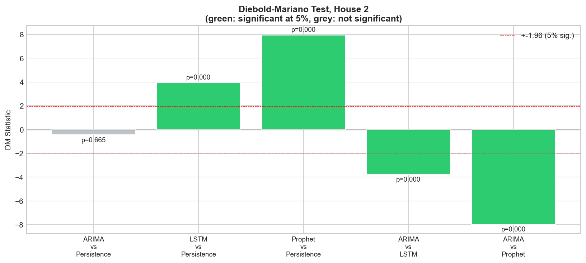
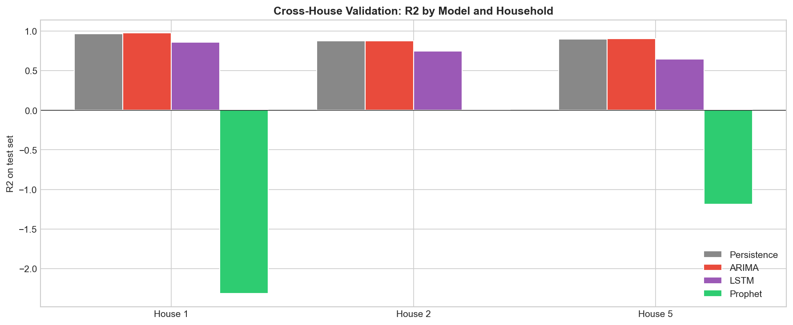

# Hane Halkı Enerji Tüketimi Tahmini

> Zaman Serisi Modelleri ile, REFIT Veri Seti Üzerinde Persistence, ARIMA, LSTM ve FB-Prophet Modellerinin Karşılaştırmalı Analizi

[](https://www.python.org/downloads/)
[](https://opensource.org/licenses/MIT)
[](https://pureportal.strath.ac.uk/en/datasets/refit-electrical-load-measurements-cleaned/)
[](#11-tekrar-üretim-rehberi)

**Ders:** EBT 629E, Yapay Zeka  
**Üniversite:** İstanbul Teknik Üniversitesi  
**Grup:** Nurullah Yıldırım (301252004), Kadir Göksel Gündüz (301241077), Furkan Çınar (301212001)  
**Tarih:** Mayıs 2026

---

## TL;DR

3 REFIT hanesi (Ev 1, 2, 5) üzerinde 4 modeli karşılaştırdık: **Persistence (baseline)**, ARIMA, LSTM, FB-Prophet. Headline bulgu:

| | House 1 | House 2 | House 5 |
|---|--:|--:|--:|
| Persistence R² | 0.963 | 0.873 | 0.901 |
| **ARIMA R²** | **0.976** | **0.876** | **0.905** |
| LSTM R² | 0.859 | 0.748 | 0.647 |
| Prophet R² | -2.315 | 0.015 | -1.186 |

**Diebold-Mariano testi (Ev 2):** ARIMA vs Persistence p=0.665 (**anlamlı değil!**). LSTM ve Prophet ise Persistence'a **anlamlı olarak kaybeder** (p<0.001).

**Ana mesaj:** Günlük konut tüketiminde lag-1 otokorelasyonu çok güçlü. Bir satırlık "yarın bugün gibi" kuralı, 129 bin parametreli LSTM'i ve karmaşık Prophet'i geride bırakıyor. ARIMA bu baseline'ı yenmez. **Karmaşık modellerin yarısı değer üretmiyor.**

---

## İçindekiler

1. [Neden Hane Enerji Tahmini?](#1-neden-hane-enerji-tahmini)
2. [Veri Seti: REFIT](#2-veri-seti-refit)
3. [Keşifsel Veri Analizi](#3-keşifsel-veri-analizi)
4. [Uçtan Uca Boru Hattı](#4-uçtan-uca-boru-hattı)
5. [Modeller](#5-modeller)
6. [Anahtar Kavrayış: Rolling vs Multi-step Protokol](#6-anahtar-kavrayış-rolling-vs-multi-step-protokol)
7. [Sonuçlar](#7-sonuçlar)
8. [İstatistiksel Anlamlılık ve Hane-Aşırı Doğrulama](#8-istatistiksel-anlamlılık-ve-hane-aşırı-doğrulama)
9. [Gelişim İterasyonları](#9-gelişim-iterasyonları)
10. [Tartışma](#10-tartışma)
11. [Tekrar Üretim Rehberi](#11-tekrar-üretim-rehberi)
12. [Proje Çıktıları](#12-proje-çıktıları)
13. [Kaynaklar](#13-kaynaklar)

---

## 1. Neden Hane Enerji Tahmini?

Akıllı sayaçların yaygınlaşması, enerji tahminini artık trafo merkezi yerine **tek bir hane düzeyinde** yapmayı mümkün kılıyor. Hane bazlı tahmin şu uygulamaların temelinde yer alıyor:

- **Talep yanıtı (demand response)** programları
- **Çatı üstü PV** öz tüketim optimizasyonu
- **Batarya şarj/deşarj** zamanlaması
- **Şebeke dengeleme** ve yedek kapasite planlaması

Tek hanenin sinyali; ani anahtarlama olayları (su ısıtıcısı, çamaşır makinesi, fırın), kullanıcıya özgü kullanım programları ve mevsimsel etkilerle son derece **gürültülü ve değişken**.

**Bu çalışmanın sorusu:** Persistence, ARIMA, LSTM ve FB-Prophet arasında tek bir hanenin günlük enerji tüketimini tahmin etmek için hangisi daha uygun, ve fark istatistiksel olarak anlamlı mı?

---

## 2. Veri Seti: REFIT

**REFIT (Personalised Retrofit Decision Support Tools for UK Homes)**, Birleşik Krallık Loughborough bölgesinde Ekim 2013 ile Haziran 2015 arasında toplanan boylamsal bir veri setidir. Strathclyde, Loughborough ve East Anglia Üniversiteleri ortaklığında EPSRC finansmanıyla üretilmiş ve **Creative Commons BY 4.0** lisansıyla yayınlanmıştır.

| Özellik | Değer |
|---------|-------|
| Hane sayısı | 20 (Ev 1 ile Ev 21, Ev 14 atlanmış) |
| Örnekleme aralığı | yaklaşık 6 ile 8 saniye |
| Toplam gözlem | yaklaşık 1.19 milyar okuma |
| Hane başı kanal | 1 toplam (aggregate) + 9 bireysel cihaz monitörü (IAM) |
| Birim | Watt (aktif güç) |
| Süre | yaklaşık 22 ay |

### Seçilen Haneler: Ev 1, Ev 2, Ev 5

Bu çalışmada üç hane test ortamı olarak kullanıldı; bu seçim **hane-aşırı doğrulama** için bilinçli yapıldı (sonuçlar yalnız Ev 2'ye özgü değil). Ev 2'nin cihazları: **Buzdolabı-Dondurucu, Çamaşır Makinesi, Bulaşık Makinesi, Televizyon, Mikrodalga, Tost Makinesi, Hi-Fi, Su Isıtıcısı, Fırın Aspiratörü**.


*Ev 2'de toplam güç kanalı ile dokuz bireysel cihaz monitörü arasındaki Pearson korelasyonu.*

---

## 3. Keşifsel Veri Analizi


- **Sol üst:** Ev 2'nin 22 ay boyunca günlük ortalama gücü. Belirgin mevsimsel döngü, kış > yaz (elektrikli ısıtma).
- **Sağ üst:** Ham 8 saniyelik veriden saatlik profil. **İki tepeli (bimodal) şekil**: küçük sabah tepesi + 16:00-20:00 belirgin akşam tepesi.
- **Sol alt:** Hafta sonu tüketimi yaklaşık %15 daha yüksek.
- **Sağ alt:** Günlük güç dağılımı, sağa çarpık (right-skewed).

---

## 4. Uçtan Uca Boru Hattı


**Beş ön işleme adımı:** Zaman damgası parse → Aykırı değer (negatif + p99 üstü) temizle → Günlük yeniden örnekleme (5.7M satır → ~630 gün) → 7 günlük hareketli ortalama yumuşatma → Forward/backward fill.

**Eğitim/Test bölmesi:** İlk %80 eğitim (~490 gün), son %20 test (~122 gün).

---

## 5. Modeller

### 5.1 Persistence Baseline (YENİ)

Bir önceki gün bugüne eşit kabul edilir: `y_hat[t] = y[t-1]`. Sıfır parametreli, mikrosaniyede çalışan tek satırlık kural. Bu olmadan hiçbir model gerçek faydasını ispat edemez.

### 5.2 ARIMA

- ADF testi: p=0.94, durağansız → d=1
- Grid search p,q ∈ [0,2], AIC ile seçim
- En iyi: **ARIMA(2, 1, 2)**, AIC = 4547.6
- Konuşlandırma: **Rolling one-step-ahead**

### 5.3 LSTM


- 3 katmanlı LSTM (128→64→32) + Dropout(0.2) + Dense(16, ReLU) + Dense(1)
- 14 günlük kayar pencere, Min-Max ölçek
- Adam, MSE, 100 epoch, batch=16, early stopping
- 128,929 parametre, seed=42

### 5.4 FB-Prophet


- Yıllık + haftalık mevsimsellik, multiplicative mod
- Tek seferlik **multi-step forecast** (test setine erişim yok)

---

## 6. Anahtar Kavrayış: Rolling vs Multi-step Protokol


**Persistence, ARIMA, LSTM** her test gününde dünün gerçek değerini görür (teacher forcing). **Prophet** ise 122 günlük test ufkunun tamamına eğitim verisine dayanarak taahhüt eder. Bu yapısal fark, Prophet'in skorlarını anlamak için kritik.

---

## 7. Sonuçlar

### 7.1 Ev 2 Performansı

| Model | MSE | RMSE (W) | MAE (W) | R² |
|:------|----:|---------:|--------:|---:|
| Persistence | 2,426.76 | 49.26 | 33.51 | 0.873 |
| **ARIMA(2, 1, 2)** | **2,370.01** | **48.68** | **32.75** | **0.876** |
| LSTM (3 katman) | 4,821.35 | 69.44 | 52.25 | 0.748 |
| FB-Prophet | 18,851.52 | 137.30 | 111.70 | 0.015 |

**ARIMA "kazanır" ama Persistence'a fark sadece 0.003 R².** Bunun gerçekten anlamlı olup olmadığını DM testi cevaplıyor (Bölüm 8).


### 7.2 Tahmin vs Gerçek


ARIMA gerçeği yakından takip eder; LSTM tepe ve dipleri yumuşatır; Prophet sadece baseline yakalar.

### 7.3 Pratik Yorum

- Ev 2 ortalama günlük tüketim: **434.8 W**
- ARIMA RMSE: **48.68 W** (ortalamanın %11.2'si)
- Eşdeğer günlük enerji hatası: **~1.17 kWh/gün**
- UK 2025 perakende fiyatı (~0.27 GBP/kWh) ile: **~0.32 GBP/gün hata**, ~10 GBP/ay

---

## 8. İstatistiksel Anlamlılık ve Hane-Aşırı Doğrulama

### 8.1 Diebold-Mariano Testi (YENİ)

Harvey-Leybourne-Newbold küçük örneklem düzeltmeli iki tarafl, kare-hata kayıp diferansiyeli üzerinden:



| Karşılaştırma | DM | p | Sonuç |
|---------------|---:|---:|-------|
| ARIMA vs Persistence | -0.43 | 0.665 | **Anlamlı fark YOK** |
| LSTM vs Persistence | +3.94 | <0.001 | Persistence anlamlı olarak iyi |
| Prophet vs Persistence | +7.95 | <0.001 | Persistence anlamlı olarak iyi |
| ARIMA vs LSTM | -3.77 | <0.001 | ARIMA anlamlı olarak iyi |
| ARIMA vs Prophet | -7.96 | <0.001 | ARIMA anlamlı olarak iyi |

### 8.2 Hane-Aşırı Doğrulama (YENİ)

Sonuçlar tek hane tesadüfü değil. Üç farklı evde de aynı sıralama:



| Model | Ev 1 | Ev 2 | Ev 5 | Yargı |
|-------|-----:|-----:|-----:|-------|
| Persistence | 0.963 | 0.873 | 0.901 | Güçlü baseline |
| **ARIMA** | **0.976** | **0.876** | **0.905** | Her evde en iyi |
| LSTM | 0.859 | 0.748 | 0.647 | Her evde Persistence altında |
| Prophet | -2.315 | 0.015 | -1.186 | Sık sık negatif R² |

---

## 9. Gelişim İterasyonları


| İterasyon | Yaklaşım | ARIMA R² |
|-----------|----------|---------:|
| 1 | Saatlik resample, 3 aylık altküme | -0.13 |
| 2 | Günlük resample, tam veri | 0.08 |
| 3 (Final) | Günlük + 7-gün yumuşatma + rolling forecast | **0.876** |

**Anahtar tasarım kararı:** Multi-step forecast → rolling one-step-ahead geçişi.

---

## 10. Tartışma

**Persistence neden bu kadar güçlü?**  
Günlük 7-gün-yumuşatılmış konut enerjisi **lag-1 otokorelasyonu** çok yüksek. Yarın ≈ bugün ilişkisi neredeyse tüm öngörülebilir yapıyı taşıyor. ARIMA bunu temiz biçimde yakalıyor ama ekstra hiçbir şey katmıyor.

**LSTM neden Persistence'a kaybediyor?**  
476 eğitim dizisi 129 bin parametreli ağ için çok az veri. Model yumuşak ortalama davranışı öğreniyor, günden güne hareketleri aşırı yumuşatıyor. Gasparin ve diğerleri (2024) aynı örüntüyü belgeliyor: az veride basit baseline'lar derin modelleri geçer.

**Prophet neden tutarsız?**  
Multi-step protokol + Prophet'ın yavaş trend odağı, günden güne değişkenliği yakalayamıyor. Cross-house'ta iki evde negatif R² (koşulsuz ortalama bile daha iyi).

**Kısıtlamalar:**  
- 3/20 hane (REFIT'in geri kalanı henüz test edilmedi)
- Univariate (hava, takvim, cihaz verisi yok)
- Heavy smoothing (high-freq içerik kayıp)

---

## 11. Tekrar Üretim Rehberi

### Gereksinimler

- Python 3.11+ (3.13 ile test edildi)
- Yaklaşık 2 GB boş disk alanı (veri seti dahil)
- (Opsiyonel) pandoc, DOCX → PDF için

### Kurulum

```bash
git clone https://github.com/RsGoksel/refit-energy-forecasting.git
cd refit-energy-forecasting
pip install -r requirements.txt
```

### Veri Seti İndirme

REFIT (~890 MB) repo'da yok, ayrıca indirin:

- **Kaggle:** https://www.kaggle.com/datasets/kyleahmurphy/uk-electrical-load
- **Strathclyde:** https://pureportal.strath.ac.uk/en/datasets/refit-electrical-load-measurements-cleaned

`archive.zip`'ten `House_1.csv`, `House_2.csv`, `House_5.csv`'yi çıkarıp `data/` klasörüne koyun.

### Çalıştırma

```bash
# Tek hane (Ev 2 default) - 4 model + Diebold-Mariano testi
python energy_forecasting.py

# 3 hane (cross-house validation)
python cross_house_validation.py

# Tüm görselleri yeniden üret
python regenerate_results_plots.py

# Belge üretimi
python generate_final_report.py            # EN report
python generate_final_report_TR.py         # TR report
python generate_presentation.py            # PPTX
```

---

## 12. Proje Çıktıları

| Dosya | Açıklama |
|-------|----------|
| [EBT629E_Final_Project_Report.pdf](EBT629E_Final_Project_Report.pdf) | İngilizce final rapor (20 sayfa, 12 görsel) |
| [EBT629E_Final_Project_Report_TR.pdf](EBT629E_Final_Project_Report_TR.pdf) | Türkçe final rapor (20 sayfa) |
| [EBT629E_Project_Presentation.pptx](EBT629E_Project_Presentation.pptx) | Sunum (18 slayt, 16:9) |
| [EBT629E_Project_Proposal.docx](EBT629E_Project_Proposal.docx) | 3 proje önerisi |
| [EBT629E_Literature_Review.docx](EBT629E_Literature_Review.docx) | Literatür incelemesi (16 kaynak) |
| [energy_forecasting.py](energy_forecasting.py) | Ana ML pipeline (4 model + DM testi) |
| [cross_house_validation.py](cross_house_validation.py) | Hane-aşırı doğrulama |
| [results/](results/) | 12 görsel + metrikler CSV |

### Üretilen Görseller

| Dosya | İçerik |
|-------|--------|
| [correlation_heatmap.png](results/correlation_heatmap.png) | Cihaz korelasyonları |
| [data_analysis.png](results/data_analysis.png) | EDA (4 panel) |
| [pipeline_diagram.png](results/pipeline_diagram.png) | ML pipeline diyagramı |
| [lstm_architecture.png](results/lstm_architecture.png) | LSTM mimarisi |
| [rolling_forecast.png](results/rolling_forecast.png) | Protokol karşılaştırma |
| [model_comparison.png](results/model_comparison.png) | Tahmin vs gerçek |
| [metrics_comparison.png](results/metrics_comparison.png) | 4 metrik bar grafiği |
| [dm_test_plot.png](results/dm_test_plot.png) | **YENİ:** Diebold-Mariano testi |
| [cross_house_comparison.png](results/cross_house_comparison.png) | **YENİ:** 3 ev karşılaştırma |
| [iteration_timeline.png](results/iteration_timeline.png) | 3 iterasyon |
| [lstm_training_history.png](results/lstm_training_history.png) | LSTM eğitim eğrileri |
| [prophet_components.png](results/prophet_components.png) | Prophet ayrıştırma |

---

## 13. Kaynaklar

Detaylı kaynakça [EBT629E_Literature_Review.docx](EBT629E_Literature_Review.docx) içinde mevcut.

1. **Murray, D., Stankovic, L., ve Stankovic, V.** (2017). An electrical load measurements dataset of United Kingdom households from a two-year longitudinal study. *Scientific Data*, 4, 160122.
2. **Bülüç, M., Sevli, O., ve Yünlü, L.** (2025). Time Series Analysis of Solar Energy Production Based on Weather Conditions. *GU J Sci, Part A*, 12(4), 1060-1077.
3. **Gasparin, A., Lukovic, S., ve Alippi, C.** (2024). Load Forecasting for Households and Energy Communities: Are Deep Learning Models Worth the Effort? [arXiv:2501.05000](https://arxiv.org/abs/2501.05000).
4. **Diebold, F. X., ve Mariano, R. S.** (1995). Comparing predictive accuracy. *Journal of Business and Economic Statistics*, 13(3), 253-263.
5. **Harvey, D., Leybourne, S., ve Newbold, P.** (1997). Testing the equality of prediction mean squared errors. *International Journal of Forecasting*, 13(2), 281-291.

---

## Lisans

[MIT Lisansı](LICENSE) — REFIT veri seti CC BY 4.0 altındadır.
